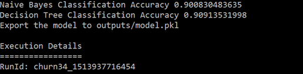

# Executing a Machine Learning Model In A Remote Environment

This hands-on lab guides us through executing a machine learning data preparation or model training work load in a remote environment using [Azure Machine Learning](https://docs.microsoft.com/en-us/azure/machine-learning/preview/overview-what-is-azure-ml). 

In this lab, we will:

- Understand how to execute our workloads on remote Data Science Virtual Machines 
- Understand how to execute our workloads on HDInsight Clusters running Spark
- Understand how to execute our workloads on remote Data Science VMs with GPU's

***NOTE:*** There are several pre-requisites for this course, including an understanding and implementation of:

- Programming using an Agile methodology
- Machine Learning and Data Science
- Intermediate to Advanced Python programming
- Familiarity with Docker containers 
- Familiarity with GPU Technology
- Familiarity with Spark programming

There is a comprehensive Learning Path we can use to prepare for this course [located here](https://github.com/Azure/learnAnalytics-CreatingSolutionswiththeTeamDataScienceProcess-/blob/master/Instructions/Learning%20Path%20-%20Creating%20Solutions%20with%20the%20Team%20Data%20Science%20Process.md).

## Executing an Experiment Locally

The general configuration for working with Azure Machine Learning has these components:


### Configuration Files

When we run a script in AML, the behavior of the execution is controlled (usually) by files in the **aml_config** folder in the experimentation directory. 
The files are:

  - ***conda_dependencies.yml*** - A conda environment file that specifies the Python runtime version and packages that the code depends on. When AML executes a script in a Docker container or HDInsight cluster, it uses this file to create a conda environment for the script to run. 
  - ***spark_dependencies.yml*** - Specifies the Spark application name when we submit a PySpark script and Spark packages that needs to be installed. We can also specify any public Maven repository or Spark package that can be found in those Maven repositories.
  - ***compute target*** files - Specifies connection and configuration information for the compute target. It is a list of name-value pairs. ***[compute target name].compute*** contains configuration information for the following environments:
    - local
    - docker
    - remotedocker
    - cluster
  - ***run configuration*** files - Specifies the Azure ML experiment execution behavior such as tracking run history, or what compute target to use
    - [run configuration name].runconfig

AML combines all of these components into one location. We can use a graphical or command-line approach to managing these components.  


### Section 1: Execution - Local and Docker Container

In this section we create an experiment, examine its configuration, and run the experiment locally, using both a `local` compute and a `docker` compute. We set up the experiment and then run all experiments from the command line interface (Azure CLI)

- Open Workbench and Create a new experiment using the Churn example.
- Launch the Azure CLI. An easy way to launch the CLI is opening a project in Workbench and navigating to **File > Open Command Prompt**.
- **Execution**: AML enables scripts to be run directly against its Python 3.5.2 runtime. This configuration is not managed by Conda unlike Docker-based executions. The package dependencies would need to be manually provisioned for the local Python environment.

To run locally, run the below command:

```
az ml experiment submit -c local CATelcoCustomerChurnModelingWithoutDprep.py
```

For running the script on local Docker, we can execute the following command in CLI:

```
az ml experiment submit -c docker CATelcoCustomerChurnModelingWithoutDprep.py
```

We should see results as follows:



### Section 2: Execute an Experiment on a remote Data Science Virtual Machine

In this section we create an experiment, examine its configuration, and run the experiment on a remote Docker container. We set up the experiment and then run all experiments from the command line interface (Azure CLI).

Go to the Azure portal and create an Ubuntu Data Science Virtual Machine]:

  - Choose a **Data Science Virtual Machine for Linux Ubuntu CSP**
  - Choose a size of *Standard D4s v3 (4 vcpus, 16 GB memory)*
  - Use a password, not a SSH Key

Start the VM and connect to it using `ssh <USER_NAME>@<VM_IP_ADDRESS>`. The IP address of the VM can be found on the resources page in the Azure portal. Check to ensure Docker is functional on the Linux DSVM with the following command:

```
sudo docker run docker/whalesay cowsay "The best debugging is done with CTRL-X. - Buck Woody"
```

Type `exit` to leave the Linux DSVM and return to the command prompt on the "local" Windows DSVM. Modify and run the following command to create both the compute target definition and run configuration for remote Docker-based executions. Note that `<REMOTE_VM>` is a name of our choosing for the remote VM. It doesn't need to match the name we chose when we provisioned the Linux DSVM. Also note that no quotes are needed for any of the arguments in the command below.

```
az ml computetarget attach remotedocker --name <REMOTE_VM> --address <IP_ADDRESS> --username <SSH_USER> --password <SSH_PASSWORD>
```

Before running against the remote VM, we need to prepare it with the project's environment by running:

```
az ml experiment prepare -c <REMOTE_VM>
```

Once we configure the compute target, we can use the following command to run the churn script.

```
az ml experiment submit -c <REMOTE_VM> CATelcoCustomerChurnModelingWithoutDprep.py
```

Note that the execution environment is configured using the specifications in `conda_dependencies.yml`.

Please take a moment to delete the Ubuntu DSVM before moving to the next section.

### (Optional) Section 3: Running on a remote Spark cluster

AML is flexible to run experimentation on big data using HDInsight Spark clusters. Note that the HDInsight cluster must use Azure Blob as the primary storage (and Azure Data Lake storage is not supported yet). Additionally, we need SSH access to the HDInsight cluster in order to execute experiments in this mode.

The first step in executing in HDInsight cluster is to create a compute target and run configuration for an HDInsight Spark cluster using the following command:

```
az ml computetarget attach cluster --name <HDI_CLUSTER> --address <FQDN_or_IP_ADDRESS> --username <SSH_USER> --password <SSH_PASSWORD>
```

Before running against the HDI cluster, we need to prepare it with the project's environment by running:

```
az ml experiment prepare -c <HDI_CLUSTER>
```

Once we have the compute context, we can run the following CLI command:

```
az ml experiment submit -c <HDI_CLUSTER> CATelcoCustomerChurnModelingWithoutDprep.py
```

The execution environment on HDInsight cluster is managed using Conda. Configuration is managed by `conda_dependencies.yml` and `spark_dependencies.yml` configuration files. 

## Lab Completion

In this lab we learned how to:

- Execute our workloads on remote Data Science Virtual Machines 
- Execute our workloads on HDInsight Clusters running Spark
